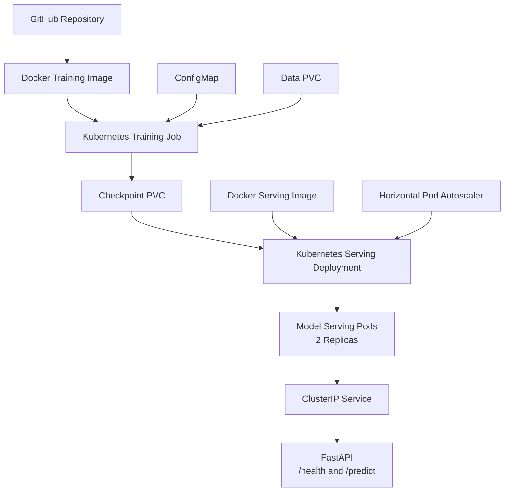

# MLOps PyTorch Pipeline

An end-to-end MLOps pipeline for training, containerizing, deploying, and serving a PyTorch image classification model using Docker and Kubernetes.

The project uses a ResNet18 model trained on the CIFAR-10 dataset and demonstrates a complete workflow from model development to scalable Kubernetes-based inference.

## Project Overview

The pipeline demonstrates:

- PyTorch model training on CIFAR-10
- Configuration-driven training
- JSON-formatted training metrics
- Model checkpointing and early stopping
- Dockerized training and inference workloads
- FastAPI-based model serving
- Kubernetes Job-based model training
- Persistent storage using PVCs
- Kubernetes Deployment with two serving replicas
- Liveness and readiness probes
- Horizontal Pod Autoscaling
- Automated model testing with GitHub Actions

## Architecture



The training Job reads configuration from a Kubernetes ConfigMap and stores the trained model checkpoint in persistent storage. The serving Deployment mounts the same checkpoint PVC as read-only storage and exposes the model through a FastAPI application.

## Project Structure

```text
mlops-pytorch-pipeline/
│
├── .github/
│   └── workflows/
│       └── ci.yml
│
├── configs/
│   └── training_config.yaml
│
├── docker/
│   ├── Dockerfile.train
│   └── Dockerfile.serve
│
├── k8s/
│   ├── namespace.yaml
│   ├── configmap.yaml
│   ├── training-job.yaml
│   ├── serving-deployment.yaml
│   ├── serving-service.yaml
│   └── hpa.yaml
│
├── requirements/
│   ├── train.txt
│   └── serve.txt
│
├── src/
│   ├── dataset.py
│   ├── model.py
│   ├── train.py
│   └── serve.py
│
├── tests/
│   └── test_model.py
│
├── .gitignore
└── README.md
```

## Model and Dataset

The project uses the CIFAR-10 dataset, which contains images belonging to 10 classes:

- airplane
- automobile
- bird
- cat
- deer
- dog
- frog
- horse
- ship
- truck

A ResNet18 architecture is used for classification, with the final fully connected layer configured for 10 output classes.

## Training Configuration

Training parameters are defined in:

```text
configs/training_config.yaml
```

The configuration includes:

- Model architecture
- Number of classes
- Number of epochs
- Batch size
- Learning rate
- Early stopping patience
- Dataset directory
- Checkpoint directory
- Model checkpoint name

This configuration is also supplied to the Kubernetes training Job through a ConfigMap.

## Local Setup

### Prerequisites

Install the following tools:

- Python 3.11+
- Docker Desktop
- kubectl
- Minikube
- Git

Clone the repository:

```bash
git clone https://github.com/devika1822/mlops-pytorch-pipeline.git
cd mlops-pytorch-pipeline
```

Create a Python virtual environment:

```bash
python -m venv .venv
```

On Windows PowerShell:

```powershell
.\.venv\Scripts\Activate.ps1
```

Install the training dependencies:

```bash
pip install -r requirements/train.txt
```

## Local Model Training

Run training using:

```bash
python src/train.py
```

Training metrics are emitted in JSON format for every epoch.

Example:

```json
{
  "epoch": 10,
  "train_loss": 0.6347,
  "train_accuracy": 0.7787,
  "val_loss": 0.6198,
  "val_accuracy": 0.7864
}
```

The best model is saved as:

```text
checkpoints/classifier_v1.pt
```

## Docker

### Build Training Image

```bash
docker build -f docker/Dockerfile.train -t mlops-train:v1 .
```

Run the training container:

```bash
docker run --rm -v ./configs:/app/configs -v ./data:/app/data -v ./checkpoints:/app/checkpoints mlops-train:v1
```

### Build Serving Image

```bash
docker build -f docker/Dockerfile.serve -t mlops-serve:v1 .
```

Run the serving container:

```bash
docker run --rm -p 8080:8080 -v ./checkpoints:/app/checkpoints mlops-serve:v1
```

Check model health:

```bash
curl http://localhost:8080/health
```

Expected response:

```json
{
  "status": "healthy",
  "model_loaded": true
}
```

## Kubernetes Deployment

Start Minikube:

```bash
minikube start --driver=docker --cpus=4 --memory=6144
```

Configure the terminal to use the Minikube Docker daemon.

PowerShell:

```powershell
minikube docker-env | Invoke-Expression
```

Build the images inside the Minikube Docker environment:

```bash
docker build -f docker/Dockerfile.train -t mlops-train:v1 .
docker build -f docker/Dockerfile.serve -t mlops-serve:v1 .
```

### Create Namespace and Training Configuration

```bash
kubectl apply -f k8s/namespace.yaml
kubectl apply -f k8s/configmap.yaml
```

### Run Training Job

```bash
kubectl apply -f k8s/training-job.yaml
```

Check the training Job:

```bash
kubectl get jobs -n ml-training
```

View training logs:

```bash
kubectl logs job/pytorch-training-job -n ml-training
```

The trained checkpoint is stored on the `ml-checkpoints-pvc` PersistentVolumeClaim.

### Deploy Model Serving

After training completes:

```bash
kubectl apply -f k8s/serving-deployment.yaml
kubectl apply -f k8s/serving-service.yaml
kubectl apply -f k8s/hpa.yaml
```

Verify the serving pods:

```bash
kubectl get pods -n ml-training
```

Inspect the Deployment:

```bash
kubectl describe deployment model-serving -n ml-training
```

Check the Horizontal Pod Autoscaler:

```bash
kubectl get hpa -n ml-training
```

## Model Inference

Forward the Kubernetes service to the local machine:

```bash
kubectl port-forward svc/model-serving 8080:80 -n ml-training
```

Health check:

```bash
curl http://localhost:8080/health
```

Send an image for prediction:

```bash
curl -X POST http://localhost:8080/predict -F "image=@test_image.png"
```

Example response:

```json
{
  "predicted_class": "cat",
  "class_index": 3,
  "probabilities": {
    "airplane": 0.000275,
    "automobile": 0.000293,
    "bird": 0.00465,
    "cat": 0.830352,
    "deer": 0.005352,
    "dog": 0.12133,
    "frog": 0.036336,
    "horse": 0.000735,
    "ship": 0.000133,
    "truck": 0.000544
  }
}
```

## Kubernetes Resources

The deployment uses the following resources:

| Resource | Purpose |
|---|---|
| Namespace | Isolates the ML workload under `ml-training` |
| ConfigMap | Supplies training configuration |
| Training Job | Executes PyTorch model training |
| Data PVC | Stores the CIFAR-10 dataset |
| Checkpoint PVC | Stores the trained model |
| Deployment | Runs two model-serving replicas |
| ClusterIP Service | Exposes model-serving pods internally |
| HPA | Scales model-serving replicas based on CPU utilization |

### Resource Limits

Training Job:

- CPU request: 2
- CPU limit: 2
- Memory request: 4 GiB
- Memory limit: 4 GiB

Model Serving:

- CPU request: 500m
- CPU limit: 1
- Memory request: 1 GiB
- Memory limit: 2 GiB

## Health Checks

The serving Deployment implements:

**Liveness probe**

```text
GET /health
Period: 10 seconds
Failure threshold: 3
```

**Readiness probe**

```text
GET /health
Initial delay: 15 seconds
Period: 5 seconds
```

## Autoscaling

The Horizontal Pod Autoscaler is configured with:

```text
Minimum replicas: 2
Maximum replicas: 5
Target CPU utilization: 70%
```

Metrics Server must be enabled in Minikube:

```bash
minikube addons enable metrics-server
```

Pod resource usage can be checked with:

```bash
kubectl top pods -n ml-training
```

## Testing

Run the model test locally:

```bash
python -m pytest -q
```

The test verifies that ResNet18 produces the expected output shape for a batch of CIFAR-10 images.

## Continuous Integration

GitHub Actions is configured in:

```text
.github/workflows/ci.yml
```

The workflow runs automatically for pushes and pull requests targeting `main` and `develop`.

The CI pipeline:

1. Checks out the repository
2. Configures Python 3.11
3. Installs CPU-compatible PyTorch and test dependencies
4. Runs the pytest test suite

## Validation Results

The Kubernetes training Job successfully completed all 10 configured epochs.

Final training metrics:

```text
Training accuracy:   77.87%
Validation accuracy: 78.64%
Best validation loss: 0.6198
```

The serving workload was successfully validated with:

- 2 running model-serving replicas
- Healthy liveness and readiness probes
- Successful `/health` response
- Successful `/predict` request
- Functional Horizontal Pod Autoscaler
- Metrics Server reporting pod CPU and memory usage

## Technologies

- Python
- PyTorch
- Torchvision
- FastAPI
- Docker
- Kubernetes
- Minikube
- GitHub Actions
- pytest